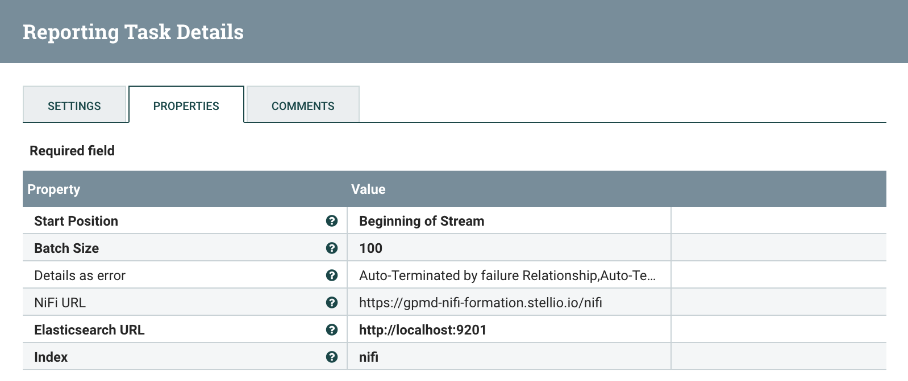
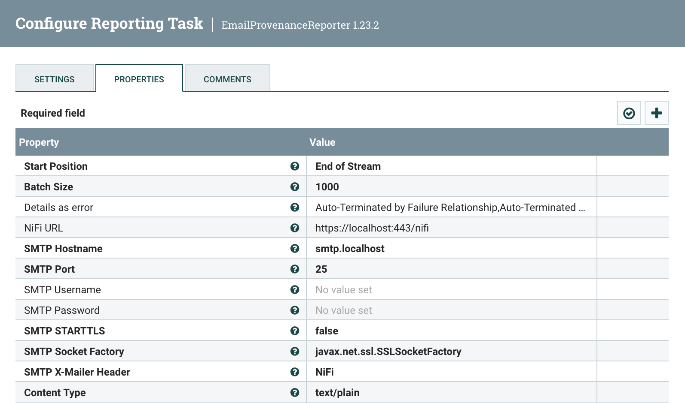

# NiFi provenance reporting tasks

[](https://spdx.org/licenses/Apache-2.0.html)


This project provides two NiFi reporting tasks to:
- Send provenance events to Elasticsearch
- Send provenance events considered as errors by email

## Table of Contents

- [Installation](#installation)
- [Tasks configuration](#tasks-configuration)
    - [ElasticsearchProvenanceReporter](#elasticsearchprovenancereporter)
    - [EmailProvenanceReporter](#emailprovenancereporter)
- [Todo](#todo)

## Installation

- Build and package the tasks

```sh
$ mvn clean package
```

- Copy the artifact to NiFi

```sh
$ cp nifi-provenance-reporting-nar/target/nifi-provenance-reporting-nar-1.23.2.nar $NIFI_HOME/lib
```

- Restart NiFi

```sh
$ nifi restart
```

## Tasks configuration

### ElasticsearchProvenanceReporter

Reporting task to write provenance events to an Elasticsearch index.

#### Reporting Task Properties



#### Example Event

```json
{
      "component_name": "RouteOnAttribute",
      "updated_attributes": "{\"RouteOnAttribute.Route\":\"Entite\"}",
      "download_input_content_uri": "https://localhost:443/nifi-api/provenance-events/123456/content/input",
      "process_group_id": "986FEB46-900F-41F9-A75F-483625C00B6C",
      "component_type": "RouteOnAttribute",
      "event_type": "ROUTE",
      "view_input_content_uri": "https://localhost:443/nifi-content-viewer/?ref=https://localhost:443/nifi-api/provenance-events/123456/content/input",
      "download_output_content_uri": "https://localhost:443/nifi-api/provenance-events/123456/content/output",
      "component_url": "https://localhost:443/nifi?processGroupId=986FEB46-900F-41F9-A75F-483625C00B6C&componentsIds=4C10F953-C5BE-452F-A212-7E17CC094DC1",
      "view_output_content_uri": "https://localhost:443/nifi-content-viewer/?ref=https://localhost:443/nifi-api/provenance-events/123456/content/output",
      "previous_attributes": "{\"PL_Type\":\"Entite\",\"fragment.identifier\":\"8165D09E-944D-4752-A584-1E36F25E24CD\",\"fragment.index\":\"7\",\"mime.type\":\"application/json\",\"PL_ID\":\"ABC_1234\",\"uuid\":\"ADEB4D7D-D86D-4305-8E36-21F2ABCCA350\",\"Entite\":\"EGM\",\"Blocage\":\"1\",\"path\":\"./\",\"filename\":\"2BFDB3F5-AC45-4B01-82B4-C2106F02836B\",\"record.count\":\"1\",\"segment.original.filename\":\"2BFDB3F5-AC45-4B01-82B4-C2106F02836B\",\"fragment.count\":\"50\",\"Libelle\":\"Public light XYZ\"}",
      "process_group_name": "Public lighting API",
      "event_time": 1696354054754,
      "status": "Info"
  }
```

### EmailProvenanceReporter

Reporting task to send provenance events considered as errors by email.

#### Reporting Task Properties



* `Email Subject Prefix` is a property that contains a prefix to be added in the email subject. It can be for example the NiFi instance the error is coming from (optional).
* `Specific Recipient Attribute Name` is a property that contains a flow file attribute name whose value will be used as an extra recipient email address when sending the email alert (optional).

## Todo

- Optional inclusion of FlowFile contents.
- Add batching support in email provenance reporter.
- Add testing.

## License

This project originated as a fork from an unmaintained project created by Joey Frazee on GitHub (https://github.com/jfrazee/nifi-provenance-reporting-bundle)
and released under the Apache License Version 2.0.

It has then diverged a lot from the original version, and it now has its own life and roadmap. It is still released under 
the Apache License Version 2.0.
